# uf TS/PDF processing / analysis update

Dean Keeble
January 2024

---
## Overview
- last significant update to process was implemented in December
- there are now parameters to potentially play with

---
## December Update

- added normalisation to OGT-IMP for best effort attempt at primary beam normalisation
- absolute solid angle correction to remove the arbitrary scale factors between detectors
- removal of the low-Q section of JF4 which often seems to be shadowed

---
## Primary beam normalisation
Karen proposed the OGT-IPM device for normalisation
- this is a quadrant detector placed after attenuators
- can be extracted from device 
```
run.get_array(f"HED_OGT_IPM/ADC/1:channel_6.output", "data.peaks")[:,0]
```
for channels 6,7,8,9

---
### Efficacy of OGT-IPM
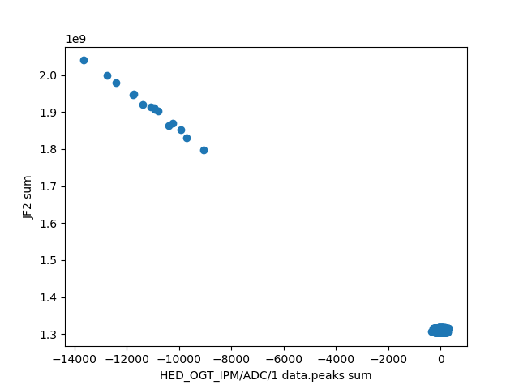
- For runs with no attenuator it appears to be quite linear

---
### Efficacy of OGT-IPM at 100% flux
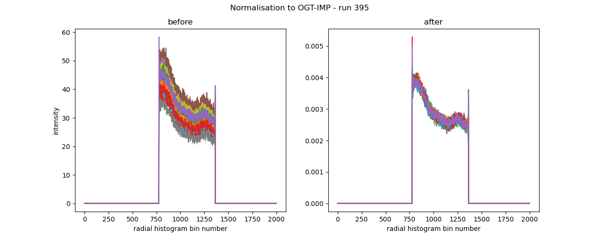

---
<style scoped>section { justify-content: start; }</style>

### Comparison of 100% and 10% flux 


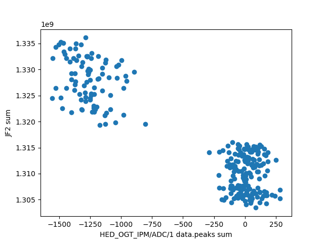


---
## Absolute Solid Angle Correction
```
 integrate1d(data, npt, filename=None, correctSolidAngle=True, ...)

    Calculate the azimuthal integration (1d) of a 2D image.

    Multi algorithm implementation (tries to be bullet proof), suitable
    for SAXS, WAXS, … and much more Takes extra care of normalization 
    and performs proper variance propagation.
    Parameters:	

        data (ndarray) – 2D array from the Detector/CCD camera
        npt (int) – number of points in the output pattern
        filename (str) – output filename in 2/3 column ascii format
        correctSolidAngle (bool) – correct for solid angle of each pixel if True
```
---
## Absolute Solid Angle Correction
- What the docs _don't_ state is that this is relative
- The pixel with the largest solid angle gets given a solid angle of 1
- For the 3 JFs this number is not comparable, hence a constant scaling offset between them
- now we normalise explicitly to the absolute solid angle

---

## low-Q shadowing
- Dean does not currently understand this

---
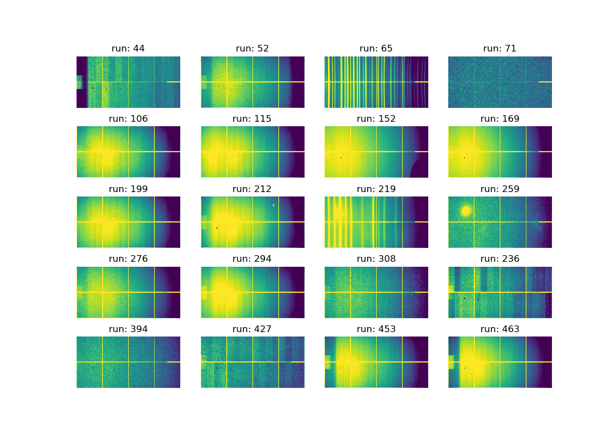

---


---


---
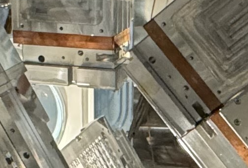

---

## THE ALL_CAPS_PARAMETERS
`ALS_LAMBDA = 1e3` # the smoothness of the background, 1e9 is essentially linear, 1e2 will follow most diffuse scattering
`ALS_P = 0.001` # the assymetry between 0 and 1, 0 being strictly always below every point, 1 being basically a fit to the data 

---

`IGNORE_EDGE_N_PTS = 10` # when fitting the background, ignore these number of points from the edges
`BASELINE_INTEROLATION_N_PTS = 5` # use this number of points from the baseline to extrapolate into the gap

---

`LOW_Q_TRIM_N_PTS = 10` # the number of points to trim from the low Q portion of the high Q detector when filling the gap
`HIGH_Q_TRIM_N_PTS = 30` # the number of points to trim from the high Q portion of the low Q detector when filling the gap

---
<style scoped>section { justify-content: start; }</style>
## `ALS_LAMBDA`
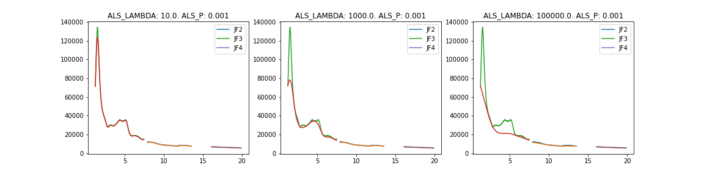

---
<style scoped>section { justify-content: start; }</style>
## `ALS_LAMBDA`
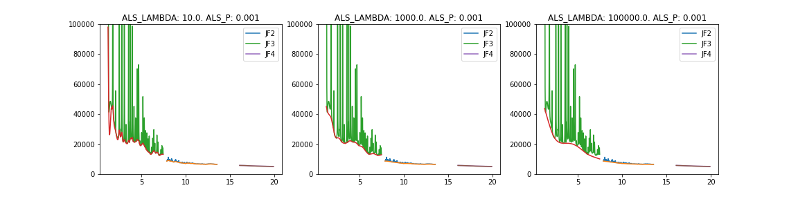

---
<style scoped>section { justify-content: start; }</style>
## `ALS_P`
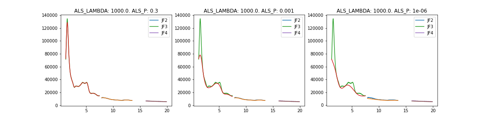

---
<style scoped>section { justify-content: start; }</style>
## `ALS_P`
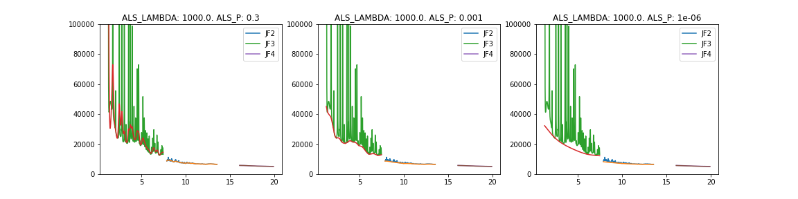

---
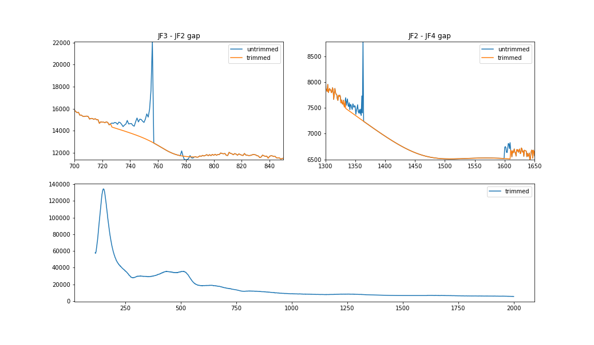


---


## Other things that could potentially be worth thinking about

- Adding JF5 to the process
- connectivity is about to be 2FA

## Improvements for next time? 

- Quicker 2D feedback
- Better use of DAMNIT


---
## Single Crystal?

> C1L3 - 50um PP + 50um Si --  10% transmission - try to see if we have TDS  

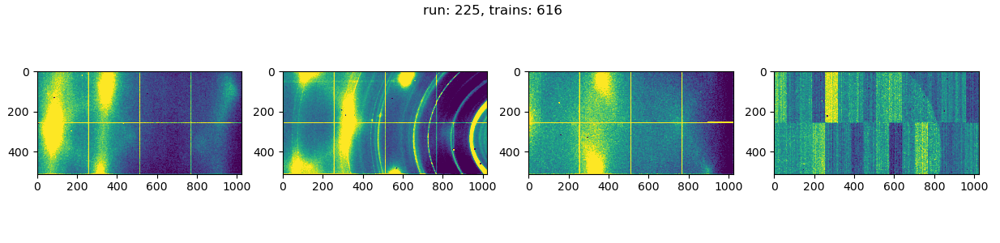

